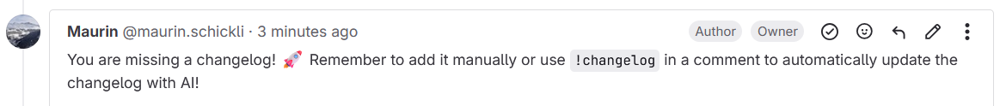

# Gitlab AI Changelog Bot

This Gitlab bot is designed to help you to never forget you changelog entry again by automatically creating a changelog entry for your merge request.

## How to use

Create a `.env` file with the environment variables specified in the `config.js`.
The `GITLAB_SECRET` is the secret token you have to set in your Gitlab webhook.

You need to create a webhook in your Gitlab project, pointing to the endpoint `/webhook`.

### Webhook Configuration

The webhook should use the URL: `https://your-bot-or-ngrok-url.com/webhook`

1. **Changelog Reminder**: Select "Merge Requests" as the trigger. This runs when you create a new merge request that's not a draft and posts a reminder comment to add a changelog entry.
   

2. **Changelog Creation**: Select "Comments" as the trigger. This runs when a comment containing `!changelog` is created on a merge request. The bot will generate a changelog entry using GPT-4o-mini based on the changes made and attempt to parse the issue number from the merge request description.

### Running the bot

If you are running the bot locally you can use `ngrok http 3000` to create a tunnel to your local machine. To start the application run `bun start`.

## Todo

- [] Add more context with Jira Ticket information
- [] Add support for quiz questions
  - [] Add support for quoting code directly in the question
  - [] Add all questions immediately instead of one by one
  - [] improve storing of questions (currently only in memory, should be stored in a database for persistence)
- [] Test the bot with more complex merge requests (real code repositories, not just the example repository)